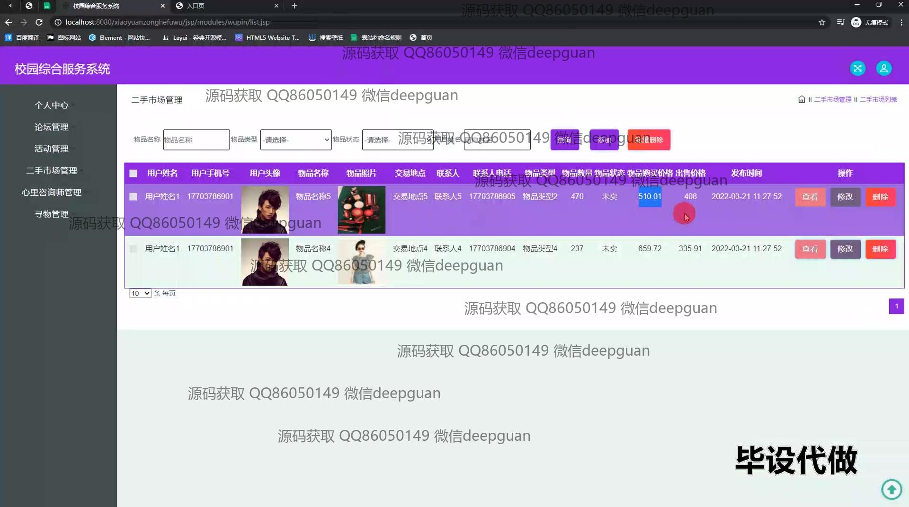
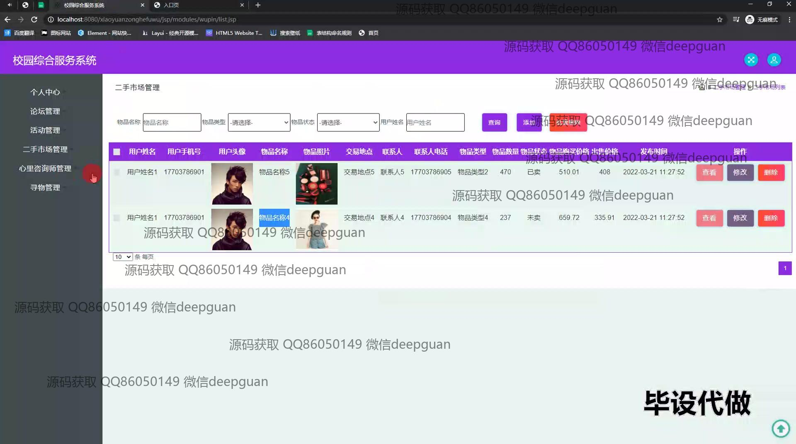

<h1 align="center">基于JAVA的校园综合服务系统+jsp</h1>

## 简介
校园综合服务系统：角色分为个人用户和管理员；功能包括论坛、活动、二手市场、心理咨询、寻物管理等，支持留言互动和用户管理，提升校园生活便利性和信息交流。    --计算机毕业设计源码；毕设源码；java毕业设计源码

## 联系方式

<h3 align="center">获取完整代码与数据库文件 + 微信：deepguan QQ: 86050149 QQ群: 783742310</h3>

<h3 align="center">可帮忙远程部署 包运行成功！提供远程部署、修改代码、设计文档指导、代码讲解等服务！</h3>

## 功能介绍（完整见运行截图）
管理员：负责整个系统的管理与维护，包括个人中心、论坛管理、活动管理、二手市场管理、心理咨询师管理、寻物管理等模块。通过查看、修改、删除操作来管理活动、商品、留言及用户信息。支持用户身份验证与权限管理，确保系统安全稳定运行，并负责客服功能及用户互动。

用户：注册、登录系统后可享受完整功能，包括浏览和参与论坛、活动、二手市场的商品交易。支持在心理咨询模块进行留言并与咨询师互动。在寻物模块，用户可以发布、查看寻物启事及进行互动交流。此外，用户拥有个人管理中心，可编辑个人信息、查看收藏及管理订单。

心理咨询师：管理心理咨询模块，包括查看、回复用户留言，帮助用户解决心理问题。通过示系统提供的工具与用户进行私密交谈，并有权限管理与维护相关信息，确保用户的留言得到及时处理。

客服：负责用户问答及反馈，提供系统使用指导。操作客服聊天功能模块，随时为用户疑问进行在线解答与交流。实时解决用户在平台使用中遇到的各种问题，为用户提供便捷、高效的服务支持。

## 运行截图

本代码来源于网络,仅供学习参考使用!

